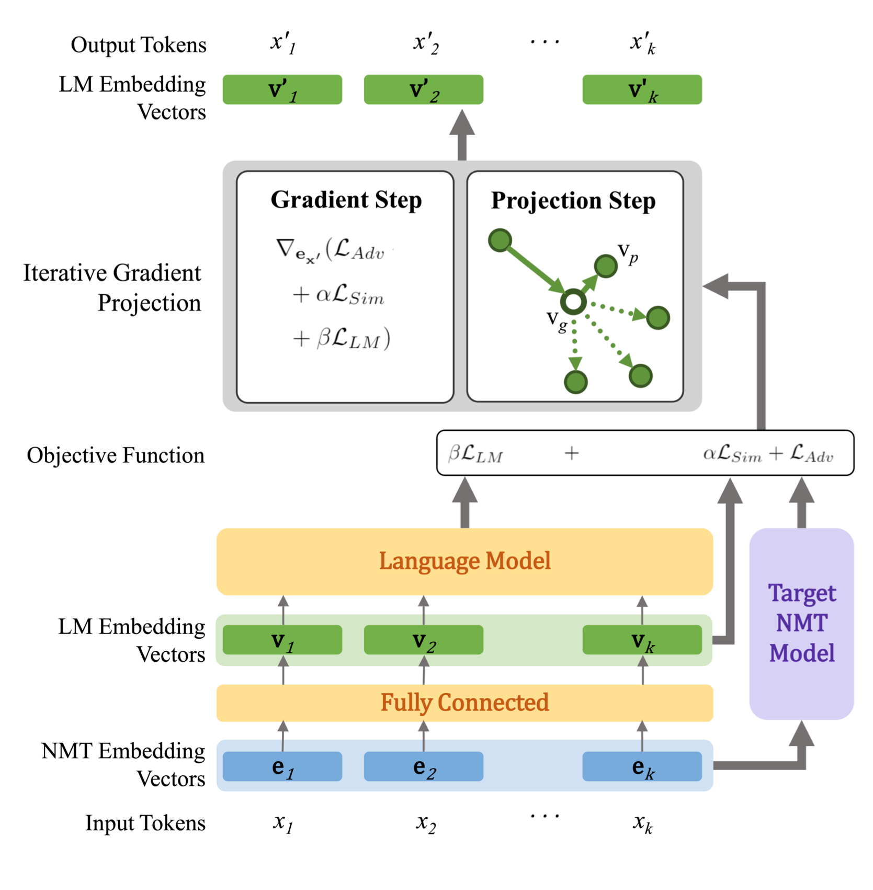

# TransFool: An Adversarial Attack against Neural Machine Translation Models


<!--  -->


This is the official repository of the paper [**"TransFool: An Adversarial Attack against Neural Machine Translation Models"**](https://openreview.net/pdf?id=sFk3aBNb81). TransFool is an adversarial attack against NMT models. By generating adversarial examples, TransFool aims to reduce translation quality while maintaining similarity to the original sentences. The adversarial exmples generated by TransFool are transferable to different settings.

### Installation
Install [conda](https://conda.io) and run the steps below:
```
$ git clone https://github.com/sssadrizadeh/TransFool.git
$ cd TransFool
$ conda env create --file=env.yml
$ conda activate attack
```

The datsets and models are available in the HuggingFace transformers package.

### Training a language model
We provide the language models that are used in our attack. You can download them from [here](https://zenodo.org/record/8081629). Please unzip and copy these folders in the [`./LanguageModel`](LanguageModel). You can also use the following code to train a CLM alongside a fully connected layer for a new target NMT model:
```sh
$ python run_clm_fc.py --model_name_or_path gpt2 --tokenizer_name Helsinki-NLP/opus-mt-en-de --dataset_name wikitext --dataset_config_name wikitext-103-raw-v1 --output_dir marian_en_de --per_device_train_batch_size=16 --per_device_eval_batch_size=16 --num_train_epochs 35 --learning_rate 1e-3
```
This code trains a language model with GPT-2 structure alongside a fully connected layer on wikitext-103-raw-v1 dataset when we want to attack Marian NMT (En-De).


### Performing whitebox attack with *TransFool* 
To attack a translation model, run the following code:
```sh
$ python TransFool/white_box_attack.py --num_samples 1000 --model_name marian --target_lang fr --dataset_config_name fr-en --dataset_name wmt14 --result_folder results
```
This code generates adversarial examples against Marian NMT for the samples 0-1000 of the WMT14 (Fr-En) dataset. 

After running the code, a pickle file is generated and saved in the "results" folder.

### Performing blackbox attack with TransFool
To attack a translation model in the blackbox setting, use the following code:
```sh
$ python TransFool/black_box_attack.py --num_samples 1000 --target_lang zh --dataset_config_name en-zh --dataset_name opus100 --result_folder results
```
This code generates adversarial examples against mBART50 for the samples 0-1000 of the opus100 (En-Zh) dataset. We use the Marian NMT model as the reference model to perform the attack.

To perform the attack when the target language of the target NMT model is differet, use the following code:
```sh
$ python TransFool/two_language_attack.py --num_samples 1000 --black_target_lang fr --result_folder results --black_model_name marian
```
In this code, *black_model_name* determines the target NMT model and *black_target_lang* is the target language. Marian NMT with a different target language is always used as the reference model.

### Evaluating the attack performance

The pickle file saved in the previous steps as the output of the attack can be evaluted by the following code:
```sh
$ python EvaluateAttack.py --num_samples 1000 --target_model_name marian --target_lang fr --result_folder results --attack_type white_box --attack_alg TransFool
```
This code evaluates the whitebox attack for all of the sentences and the successful ones. The performance is evaluted in terms of the average semantic similarity between the original sentences  and the adversarial, the token error rate, the attack success rate, relative decrease in translation quality, and the perplexity score of the adversarial sentences. You can change the arguments of the code according to the attack you want to evalute.


### Citation
If you found this repository helpful, please don't forget to cite our paper:
```BibTeX
@article{sadrizadeh2023transfool,
title={TransFool: An Adversarial Attack against Neural Machine Translation Models},
author={Sahar Sadrizadeh and Ljiljana Dolamic and Pascal Frossard},
journal={Transactions on Machine Learning Research},
issn={2835-8856},
year={2023},
url={https://openreview.net/forum?id=sFk3aBNb81},
note={}
}
```
In case of any question, please feel free to contact  [sahar.sadrizadeh@epfl.ch](mailto:sahar.sadrizadeh@epfl.ch).
